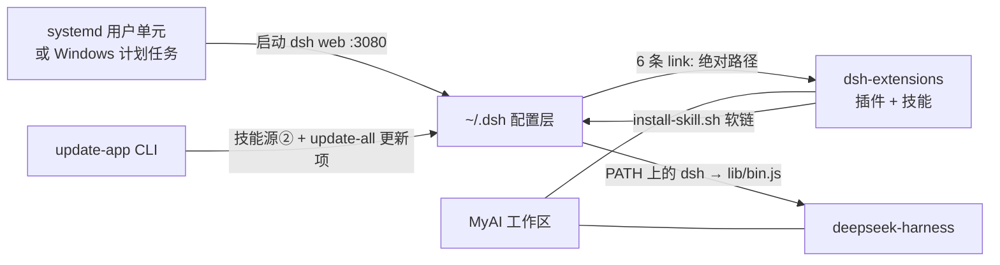

# INSTALL — 重建这套 DSH 工作栈

面向**新设备首次安装**和**同机重装**。人照着敲，AI 照着执行。
覆盖五块：本工作区（MyAI）、DSH 本体（deepseek-harness）、扩展集合（dsh-extensions）、
配置层（`~/.dsh`）、以及 update-all 的 CLI（update-app）；最后部署为**开机自启**服务。

**平台**：Linux 用 `bash` + systemd 用户单元；Windows 用 PowerShell + 计划任务（或 NSSM 服务）。
两段命令**不混用**——按你所在平台的章节走完整条链路。

> **文档状态**：Linux 段在 Arch 生产机上逐条核对（2026-09-13，DSH 0.1.5-rc.2，实例 :3080）。
> Windows 段由仓库事实推导（CI 有 windows 门禁、`build:native-system` 在非 Linux/macOS 上空转、`homedir()` 解析 `%USERPROFILE%`），
> **未在 Windows 实机验证**；首次执行若与本文不符，以实际报错为准并回来修正本文。

---

## 0. 装什么：拓扑与依赖方向

| 组件 | 规范路径 | 角色 | 来源 |
|---|---|---|---|
| 工作区 | `~/projects/MyAI` | 宿主/编排层，登记两个 submodule | `github.com/xgx1/MyAI-workspace` |
| DSH 本体 | `~/projects/MyAI/deepseek-harness` | 生产实例跑的代码（submodule） | `github.com/xgx1/deepseek-harness`（fork） |
| 扩展集合 | `~/projects/MyAI/dsh-extensions` | 3 自研插件 + 16 个二级 submodule（13 技能分组仓 + 3 vendor） | `github.com/xgx1/dsh-extensions` |
| 更新的 CLI | `~/projects/update-app` | update-all 的 CLI（.NET 10），**不在工作区内** | `github.com/xgx1/update-app` |
| 配置层 | `~/.dsh` | preset / profile composition / 启动脚本 / unit 源 | `github.com/xgx1/dsh-home` |



**三条硬约束**（装错都卡在这三处）：

1. `~/.dsh` 重建不了环境——它的 profile 依赖是 6 条**绝对** `link:` 路径，必须**先有项目、后装配置层**。
2. 插件的 `lib/` 是构建产物、不入库；**克隆完必须逐个 build**，否则 profile 起不来。
3. 服务最后装：重启 `dsh-web` **会中断当前对话**（如果你正跑在它上面）。

**给 AI 的执行约定**：逐节执行，每节以「**验收**」为完成判据——验收不过不进下一节；
失败先读报错原文再改方案；路径与本机不同（用户名不是 `sx`）时先做 §1.3 的路径改写。

---

## 1. 前置：路径与工具链

### 1.1 规范路径（下文所有命令都基于它）

```bash
export WS="$HOME/projects/MyAI"          # 本工作区
export EXT="$WS/dsh-extensions"          # 扩展集合
export HARNESS="$WS/deepseek-harness"    # DSH 本体
export APP="$HOME/projects/update-app"   # update-all 的 CLI
export DSH_HOME="$HOME/.dsh"             # DSH 配置层
export PATH="$HOME/.local/bin:$PATH"     # dsh / headroom / cbm 都落在这
```

```powershell
$WS      = "$env:USERPROFILE\projects\MyAI"
$EXT     = "$WS\dsh-extensions"
$HARNESS = "$WS\deepseek-harness"
$APP     = "$env:USERPROFILE\projects\update-app"
$DSH_HOME= "$env:USERPROFILE\.dsh"
$env:PATH = "$env:USERPROFILE\.local\bin;$env:PATH"
```

### 1.2 工具链

| 工具 | 版本要求 | Linux（Arch） | Windows |
|---|---|---|---|
| git | ≥ 2.26 | `sudo pacman -S --needed git` | `winget install Git.Git` |
| Node.js | `^22.19 \|\| >=24` | `sudo pacman -S --needed nodejs npm` | `winget install OpenJS.NodeJS.LTS` |
| pnpm | **11.7.0**（仓库 `packageManager` 固定值） | `sudo pacman -S --needed pnpm` 或 `npm i -g pnpm@11.7.0` | `npm i -g pnpm@11.7.0` |
| C 编译器 | Linux/macOS 构建 flock 插件必需 | `sudo pacman -S --needed base-devel`（含 `cc`） | 不需要：`build:native-system` 在 Windows 空转 |
| .NET SDK | **10**（update-app 目标 `net10.0`） | `sudo pacman -S --needed dotnet-sdk` | `winget install Microsoft.DotNet.SDK.10` |
| uv（可选） | 装 MCP 用 | `sudo pacman -S --needed uv` | `winget install astral-sh.uv` |

> `winget` 的包 id 会随上游调整，装之前用 `winget search <关键字>` 确认；报「找不到匹配的包」就换搜索到的 id。
> 下文用 `jq` 读 `current.json`（Arch：`sudo pacman -S --needed jq`）；没有 jq 就直接看文件，或 `python3 -c` 取 `exe` 字段。

MCP 前置（**不装就静默消失**，见 §7 坑表）：`codebase-memory-mcp`、`playwright-mcp`、`headroom`。

```bash
uv tool install codebase-memory-mcp     # -> ~/.local/bin/codebase-memory-mcp
uv tool install headroom-ai             # -> ~/.local/bin/headroom（同时提供 :8787 代理）
npm i -g @playwright/mcp && npx playwright install chromium
```

**验收**：`node -v` ≥ 22.19、`pnpm -v` = 11.7.0、`dotnet --list-sdks` 有 10.x，
且 `for c in git node pnpm cc dotnet; do command -v $c; done` 全部有输出（Windows 段 `cc` 除外）。

### 1.3 路径改写（用户名不是 `sx` 时必做）

仓库里有一批**绝对** `/home/sx/projects/MyAI` 路径，共 8 个文件，两处：`dsh-extensions/plugins/*` 的 `package.json`
（开发依赖 `link:` 指向 harness 检出）与 `~/.dsh/profiles/web/{package.json,pnpm-lock.yaml}`（6 条 `link:` 运行时依赖）。

```bash
# 在 §2.4 / §2.6 之前执行；幂等，重复跑无害
grep -rl '/home/sx/projects/MyAI' \
     --include=package.json --include=pnpm-lock.yaml \
     "$WS/dsh-extensions" "$HOME/.dsh/profiles" 2>/dev/null \
  | xargs -r sed -i "s|/home/sx/projects/MyAI|$HOME/projects/MyAI|g"
```

```powershell
$old = '/home/sx/projects/MyAI'
$new = ($WS -replace '\\','/')          # JSON 里用正斜杠，避免反斜杠转义
Get-ChildItem -Path $EXT, "$DSH_HOME\profiles" -Recurse -Include package.json,pnpm-lock.yaml -File |
  Where-Object { $_.FullName -notmatch '\\node_modules\\' } |
  ForEach-Object { (Get-Content -Raw $_.FullName).Replace($old,$new) | Set-Content -NoNewline $_.FullName }
```

**验收**：`grep -rn '/home/sx/projects/MyAI' --include=package.json --include=pnpm-lock.yaml "$EXT" "$DSH_HOME/profiles" | grep -v node_modules` 无输出。

### 1.4 平台规则：shell 工具与执行器二选一（**Linux = bash，Windows = pwsh，另一个禁用**）

shell 能力落在两个平面上，**两个平面都要对上，且同一平台只挂一种 shell**：

| 平面 | Linux 用 | Windows 用 | 落点 |
|---|---|---|---|
| 模型工具（一次性命令） | `@deepseek-ai/dsh-tool-bash` | `@deepseek-ai/dsh-tool-pwsh` | `~/.dsh/.agent-presets/{omni,manager}/agent.cordis.yml` |
| 模型工具（持久 shell） | `@deepseek-ai/dsh-tool-bash-persistent` | `@deepseek-ai/dsh-tool-pwsh-persistent` | `~/.dsh/.agent-presets/simple/agent.cordis.yml` |
| 执行器（host 平面，真正起进程） | `@deepseek-ai/dsh-bash-local` | `@deepseek-ai/dsh-pwsh-local` | `~/.dsh/profiles/web/cordis.patch.yml` |

工具行决定「模型看得见哪个工具」，执行器行决定「命令由谁跑」；`dsh-bash-local`（POSIX bash）与
`dsh-pwsh-local`（PowerShell）语义一一对应——**只挂本平台那一个**。

**必须写成平台表达式，不能写死 `disabled: true`**：`~/.dsh` 是跨设备同步的同一份文件，
写死会在另一平台上把 shell 工具整个关掉。两行成对且互补：

```yaml
- id: tool-bash
  name: '@deepseek-ai/dsh-tool-bash'
  disabled: !!js process.platform === 'win32'      # Linux 上为 false → 启用

- id: tool-pwsh
  name: '@deepseek-ai/dsh-tool-pwsh'
  disabled: !!js process.platform !== 'win32'      # Linux 上为 true → 禁用
```

`!!js` 只允许出现在插件 `config` 与条目 `disabled` 两个位置，其余字段必须字面量。
自己新写预设时同此规则；三条用户预设（`omni`/`manager`/`simple`）已按此写好。

**验收（Linux，`~/.dsh` 装好后）**：

```bash
# ① 预设平面：bash 行必须是 === 'win32'，pwsh 行必须是 !== 'win32'
grep -h -A2 'id: \(tool\|persistent\)-\(bash\|pwsh\)$' ~/.dsh/.agent-presets/{omni,manager,simple}/agent.cordis.yml | grep disabled
# ② host 平面：本平台执行器（bash-local）在，且它后面没有 disabled 行
grep -n -A2 'id: bash-local$\|id: pwsh-local$' ~/.dsh/profiles/web/cordis.patch.yml
```

期望：① 打印 **6 行**——三条预设各一对互补表达式（`=== 'win32'` 一行、`!== 'win32'` 一行），
顺序永远是 bash 在前；② `bash-local` 在且其后**没有** `disabled:`；
若同时出现 `pwsh-local`，它必须紧跟 `disabled: !!js process.platform !== 'win32'`（推荐的两行形态，见 §4.6 ④）。
最强证据是运行时——新开一个会话，Linux 上模型只该拿到 `bash`，没有 `pwsh`。

**验收（Windows）**：预设无需改动（表达式自动翻面），但 **host 执行器要换成 `pwsh-local`**，见 §4.6 ④⑤。

---

## 2. Linux 安装

### 2.1 拉工作区与全部子模块

```bash
mkdir -p ~/projects && cd ~/projects
git clone https://github.com/xgx1/MyAI-workspace.git MyAI
cd "$WS"
git submodule update --init --recursive     # 18 个：2 顶层 + dsh-extensions 下 16
```

**验收**：`cd "$WS" && git submodule status --recursive | grep -c '^-'` 输出 `0`（`-` 表示未初始化）。

### 2.2 构建 DSH 本体

```bash
cd "$HARNESS"
pnpm install            # 版本必须是 11.7.0；lockfile 被重写就是漂移，不要提交
pnpm run build          # 分钟级：native 插件(cc) → host/client lib → web 前端
```

`pnpm run build` = `build:native-system` + `build:lib` + `build:web`。
报 `Node-API headers missing` 说明 Node 没带头文件（Arch 的 `nodejs` 自带 `/usr/include/node`）；
报 `cc` 找不到（`ENOENT` / `spawnSync cc`）说明缺编译器，装 `base-devel`。

**验收**：`node "$HARNESS/apps/cli/lib/bin.js" --version` 打印版本号（本机 `0.1.5-rc.2`）。

### 2.3 让 `dsh` 上 PATH

```bash
mkdir -p ~/.local/bin
ln -sfn "$HARNESS/apps/cli/lib/bin.js" ~/.local/bin/dsh
chmod +x "$HARNESS/apps/cli/lib/bin.js"
```

**验收**：`command -v dsh && dsh --version` 两行都有输出。

### 2.4 构建扩展（最容易漏的一步）

`plugins/*/lib/`、`vendor/*/lib/` 都是构建产物、被 `.gitignore` 排除，克隆后必须逐个 build。
插件 `package.json` 的 devDependencies 用 `link:` 指向 harness 检出，所以 §2.2 必须先做完。

```bash
for p in "$EXT"/plugins/*/; do (cd "$p" && pnpm install && pnpm run build); done

(cd "$EXT/vendor/dsh-genui"       && pnpm install && pnpm run build)
(cd "$EXT/vendor/dsh-evolve-modes" && pnpm install && pnpm run build)
(cd "$EXT/vendor/dsh-toolkit"     && npm install  && npm run build:all)   # 这个仓用 npm + 10 个子包
```

**验收**：以下路径全部存在——
`$EXT/plugins/{dsh-sidebar-taskbar,dsh-task-manager,web-dsh-web-extension}/lib/index.js`、
`$EXT/vendor/{dsh-genui,dsh-evolve-modes,dsh-toolkit}/lib/index.js`。

### 2.5 装 update-app（update-all 的 CLI）

```bash
git clone https://github.com/xgx1/update-app.git ~/projects/update-app
cd "$APP"
dotnet build -c Release      # 先确认能编译
dotnet run  -- self          # 自更新：git pull 自身 + publish 到 bin/<时间戳>/ + 写 bin/current.json
```

`self` 写完的 `bin/current.json` 是 `{"exe": "...update-app.dll", "publishedAt": "..."}` —— 这就是**CLI 自举指针**，
后续一律 `dotnet "$(jq -r .exe "$APP/bin/current.json")" <命令>`。

**验收**：`dotnet "$(jq -r .exe "$APP/bin/current.json")" validate` 全部 `[ok]`，其中 `[ok] dotnet:` 指向你的 SDK。

### 2.6 装配置层 `~/.dsh`

```bash
# ① 取回仓库（目录不存在就 clone；已存在且有运行时数据则按 ~/.dsh/README.md「新设备恢复」的 init 流程）
git clone https://github.com/xgx1/dsh-home.git ~/.dsh

# ② 路径改写：现在跑一遍 §1.3——它要改的就是 ~/.dsh/profiles/web 里的两个文件

# ③ 重建 profile 依赖（6 条 link: 指向 §2.4 构建好的产物）
cd "$DSH_HOME/profiles/web"
pnpm install
mkdir -p patches        # 空目录不进 git，但 composition 需要它存在

# ④ 凭据：三选一，优先级从高到低
cp "$DSH_HOME/keys.example.yaml" "$DSH_HOME/.credentials.yaml"
chmod 600 "$DSH_HOME/.credentials.yaml"        # 非 600 时 DSH 拒绝加载（POSIX）
#    填入 DEEPSEEK_API_KEY（顶层只允许 version/refs/records，空值非法）；
#    或直接用 dsh 配置界面逐个保存；或用启动环境覆盖：DEEPSEEK_API_KEY=… dsh web

# ⑤ 技能软链（302 条，指向 dsh-extensions/skills、update-app/skills、各项目 .dsh/skills）
mkdir -p "$DSH_HOME/skills"                    # ← 该目录被 gitignore，新机不存在时安装器会直接退出
"$EXT/install-skill.sh" --dry-run              # 先看会做什么
"$EXT/install-skill.sh"

# ⑥ shell 平台规则核对：按 §1.4「验收（Linux）」跑那两条命令（预设表达式 + bash-local 执行器）
```

**验收**：`ls "$DSH_HOME/skills" | wc -l` 与 `find "$DSH_HOME/skills" -maxdepth 1 -type l | wc -l` **相等**
（全软链，无副本）；`"$EXT/install-skill.sh" --dry-run` 输出里「新建 0」。

### 2.7 冒烟：手动起一次 Web UI

```bash
cd ~ && dsh web --no-open >/tmp/dsh-smoke.log 2>&1 &
sleep 25
curl -s http://127.0.0.1:3080 | head -c 60     # 期望：dsh web authentication required…
kill %1
```

**验收**：上面 `curl` 打印 `dsh web authentication required; reopen the URL printed by dsh web.`
——**401 就是健康**：服务在跑，只是没带访问令牌。真正可点的地址是启动时打印的 `?token=…`。

---

## 3. Linux 部署为 systemd 用户服务

unit 的权威副本在 `~/.dsh/deploy/systemd-user/`（**不在** `~/.config/systemd/user/`，那里不受 git 管理）。

```bash
"$DSH_HOME/deploy/install-systemd-units.sh" --dry-run   # 先看会做什么
"$DSH_HOME/deploy/install-systemd-units.sh"             # 写入 + daemon-reload + enable

systemctl --user start headroom-deepseek.service        # :8787，模型 baseURL 的目标，先起
systemctl --user start dsh-web.service                  # ← 会中断当前对话，确认后再敲

loginctl enable-linger "$USER"                          # 可选：不登录也随开机自启
```

两个 unit 的关系：`dsh-web.service` 是生产实例（:3080）并**拉起全部 MCP 子进程**；
`headroom-deepseek.service` 提供 `:8787`，而 `settings.yaml` 的模型 `baseURL` 正指向它——
**不起 headroom，模型请求会连不上**。unit 里没有任何密钥：`dsh-web-launch.sh` 会 source `dsh-env.sh`
把 `.credentials.yaml` 的 `*_API_KEY` 注入启动环境。

**验收**：

```bash
systemctl --user is-active dsh-web headroom-deepseek      # 两行 active
curl -s -o /dev/null -w '%{http_code}\n' http://127.0.0.1:3080    # 401 = 健康
journalctl --user -u dsh-web --no-pager | grep -o 'http://127.0.0.1:3080/?token=[^ ]*' | tail -1
```

最后一行给出**可直接在浏览器打开的地址**（含一次性令牌），这是唯一能真正进 UI 的入口。

---

## 4. Windows 安装

与 Linux 的差异只有三处：没有 `cc` 要求、`~/.dsh` 的 `link:` 路径要写成 Windows 形式、服务换成计划任务。

### 4.1 预检

```powershell
# 长路径（node_modules 层级很深；不开会在 pnpm install 阶段随机失败）
git config --global core.longpaths true
reg query "HKLM\SYSTEM\CurrentControlSet\Control\FileSystem" /v LongPathsEnabled   # 期望 0x1
```

### 4.2 拉工作区与子模块

```powershell
New-Item -ItemType Directory -Force -Path "$env:USERPROFILE\projects" | Out-Null
git clone https://github.com/xgx1/MyAI-workspace.git "$WS"
Set-Location $WS
git submodule update --init --recursive
```

**验收**：`git submodule status --recursive | Select-String '^-'` 无输出。

### 4.3 构建 DSH 本体 + `dsh` 命令

```powershell
Set-Location $HARNESS
pnpm install
pnpm run build          # native 段在 Windows 自动空转；host/client/web 正常构建
```

Windows 没有符号链接式安装，用 `dsh.cmd` 垫片：

```powershell
New-Item -ItemType Directory -Force -Path "$env:USERPROFILE\.local\bin" | Out-Null
@'
@echo off
node "%USERPROFILE%\projects\MyAI\deepseek-harness\apps\cli\lib\bin.js" %*
'@ | Set-Content -Encoding ASCII "$env:USERPROFILE\.local\bin\dsh.cmd"

# 把 ~\.local\bin 加进用户 PATH（新开终端生效）
$userPath = [Environment]::GetEnvironmentVariable('Path','User')
if ($userPath -notlike "*\.local\bin*") {
  [Environment]::SetEnvironmentVariable('Path', "$env:USERPROFILE\.local\bin;$userPath", 'User')
}
```

**验收**：新开 PowerShell → `dsh --version` 打印版本号。

### 4.4 构建扩展

先做 §1.3 的 PowerShell 版路径改写（`$EXT` 的 `package.json` 里 devDependencies 指向 harness 绝对路径），再：

```powershell
Get-ChildItem "$EXT\plugins" -Directory | ForEach-Object {
  Push-Location $_.FullName; pnpm install; pnpm run build; Pop-Location
}
foreach ($v in 'dsh-genui','dsh-evolve-modes') {
  Push-Location "$EXT\vendor\$v"; pnpm install; pnpm run build; Pop-Location
}
Push-Location "$EXT\vendor\dsh-toolkit"; npm install; npm run build:all; Pop-Location
```

**验收**：同 §2.4 的 6 个 `lib\index.js` 路径全部存在。

### 4.5 装 update-app

```powershell
git clone https://github.com/xgx1/update-app.git "$APP"
Set-Location $APP
dotnet build -c Release
dotnet run  -- self
```

**验收**：`& (Get-Content "$APP\bin\current.json" -Raw | ConvertFrom-Json).exe validate` 全部 `[ok]`。

### 4.6 装配置层 `~/.dsh`

```powershell
git clone https://github.com/xgx1/dsh-home.git "$DSH_HOME"

# ① 路径改写成 Windows 形式（JSON 用正斜杠）
$old = '/home/sx/projects/MyAI'; $new = ($WS -replace '\\','/')
foreach ($f in "$DSH_HOME\profiles\web\package.json", "$DSH_HOME\profiles\web\pnpm-lock.yaml") {
  (Get-Content -Raw $f).Replace($old,$new) | Set-Content -NoNewline $f
}

# ② profile 依赖
Set-Location "$DSH_HOME\profiles\web"
pnpm install
New-Item -ItemType Directory -Force -Path patches | Out-Null

# ③ 凭据（Windows 不检查 POSIX 权限位）
Copy-Item "$DSH_HOME\keys.example.yaml" "$DSH_HOME\.credentials.yaml"
#    填入 DEEPSEEK_API_KEY；或临时用启动环境覆盖：$env:DEEPSEEK_API_KEY='sk-…'; dsh web

# ④ shell 执行器换成 pwsh（Linux 那份插的是 bash-local，它在 Windows 上起不来 bash）
#    推荐做法：两行都插、各带平台表达式（一次改好，所有设备都不用再动）——
#    编辑 $DSH_HOME\profiles\web\cordis.patch.yml，把 bash-local 那一行替换成两行：
#      - id: bash-local
#        name: '@deepseek-ai/dsh-bash-local'
#        disabled: !!js process.platform === 'win32'
#      - id: pwsh-local
#        name: '@deepseek-ai/dsh-pwsh-local'
#        disabled: !!js process.platform !== 'win32'
#    只插 pwsh-local 也能跑，但那份 patch 就与其他设备不同源，下次同步会冲突。
#    改完在 ~/.dsh 里 commit + push，Linux 那台 pull 后同样成立。

# ⑤ 预设平面无需改动：三条预设带的是平台表达式，Windows 上 tool-pwsh 自动启用、tool-bash 自动禁用
```

技能软链：`install-skill.sh` 是 bash 脚本，Windows 走 **Git Bash** 最稳（同一份被验证过的脚本）：

```bash
# 在 Git Bash（管理员或已开「开发者模式」）里执行
export MSYS=winsymlinks:nativestrict
mkdir -p ~/.dsh/skills
~/projects/MyAI/dsh-extensions/install-skill.sh --dry-run
~/projects/MyAI/dsh-extensions/install-skill.sh
```

没有开发者模式/管理员权限时建不了软链，按代价排序三条出路：
① 开「开发者模式」（设置 → 系统 → 开发者选项）后重开 Git Bash —— 一次性，之后与 Linux 完全等价（**推荐**）；
② 用管理员身份跑 Git Bash —— 同样能建原生软链；
③ 都不行才退回复制：`install-skill.sh --list` 会打印**每个受管技能及它的源目录**（三个源都在内），
   逐个 `Copy-Item -Recurse` 到 `~\.dsh\skills\<名字>`。复制即副本，改完技能必须重新复制——
   这正是 Linux 侧用软链要消灭的漂移，所以它是下策而非常规做法。

**验收**：`ls -la ~/.dsh/skills | grep -c '\->'` 大于 300；`install-skill.sh --dry-run` 显示「新建 0」。

**验收（shell 平台规则，对应上面 ④⑤）**：

```powershell
Get-ChildItem "$DSH_HOME\.agent-presets" -Recurse -Filter agent.cordis.yml |
  Select-String -Pattern 'id: tool-(bash|pwsh)$' -Context 0,1
Select-String -Path "$DSH_HOME\profiles\web\cordis.patch.yml" -Pattern 'id: (bash|pwsh)-local$' -Context 0,1
```

期望：每个预设都打印出**成对互补**的 `disabled: !!js process.platform …`；执行器只出现 `pwsh-local`。
最强证据是运行时——新会话里模型只该拿到 `pwsh`，没有 `bash`。

### 4.7 冒烟

```powershell
$p = Start-Process -FilePath "$env:USERPROFILE\.local\bin\dsh.cmd" `
       -ArgumentList 'web','--no-open' -PassThru -NoNewWindow
Start-Sleep -Seconds 25
try { Invoke-WebRequest -UseBasicParsing http://127.0.0.1:3080 } catch { $_.Exception.Response.StatusCode.value__ }
taskkill /T /F /PID $p.Id        # 连同 node 子进程一起收掉
```

**验收**：输出 `401`（健康；服务在跑、未带令牌），控制台另有 `?token=…` 的可点地址。

---

## 5. Windows 部署为开机自启动

### 5.1 启动器脚本

等价于 Linux 的 `dsh-web-launch.sh`：注入凭据 → 起 headroom 代理 → 前台跑 `dsh web`。
存为 `%USERPROFILE%\.dsh\dsh-web-launch.ps1`（放在 `~/.dsh` 里，和 Linux 那份同一位置）：

```powershell
param([switch]$Service)                     # -Service：输出转日志（计划任务下看不到控制台）
$ErrorActionPreference = 'Continue'
$DshHome = Join-Path $env:USERPROFILE '.dsh'
$env:DSH_HOME = $DshHome
$env:PATH = "$env:USERPROFILE\.local\bin;$env:PATH"

# 1) .credentials.yaml 的 *_API_KEY → 进程环境（等价 dsh-env.sh）
$cred = Join-Path $DshHome '.credentials.yaml'
if (Test-Path $cred) {
  foreach ($line in Get-Content -LiteralPath $cred) {
    if ($line -notmatch '^\s*[A-Za-z_][A-Za-z0-9_]*\s*:') { continue }
    $k, $v = $line -split ':', 2
    $k = $k.Trim(); $v = $v.Trim().Trim('"').Trim("'")
    if ($k -like '*_API_KEY' -and $v) { Set-Item -Path "env:$k" -Value $v }
  }
}

# 2) headroom 代理（settings.yaml 的 baseURL = http://127.0.0.1:8787/v1）
$headroom = Join-Path $env:USERPROFILE '.local\bin\headroom.exe'
if (Test-Path $headroom) {
  $env:HEADROOM_PORT='8787'; $env:HEADROOM_HOST='127.0.0.1'; $env:HEADROOM_MODE='cache'
  $env:HEADROOM_SAVINGS_PROFILE='coding'; $env:HEADROOM_LOSSLESS='1'
  $env:HEADROOM_PROTECT_RECENT='3'; $env:HEADROOM_OUTPUT_SHAPER='1'; $env:HEADROOM_EFFORT_ROUTER='0'
  $env:OPENAI_TARGET_API_URL='https://api.deepseek.com'
  foreach ($p in 'ALL_PROXY','all_proxy','HTTP_PROXY','http_proxy','HTTPS_PROXY','https_proxy') {
    Set-Item -Path "env:$p" -Value ''
  }
  Start-Process -FilePath $headroom -ArgumentList 'proxy' -WindowStyle Hidden
  for ($i = 0; $i -lt 30; $i++) {
    try { (New-Object Net.Sockets.TcpClient).Connect('127.0.0.1', 8787); break } catch { Start-Sleep 1 }
  }
}

# 3) 前台跑 Web UI；进程退出由计划任务的「失败重启」负责拉起
if ($Service) { & dsh web --no-open *>> (Join-Path $DshHome 'dsh-web.log') }
else          { & dsh web --no-open }
```

> 不想用 headroom：把 `~/.dsh/settings.yaml` 的 `llm-deepseek.baseURL` 改回 `https://api.deepseek.com`
> （或你用的端点），第 2 段整段可以删。

### 5.2 注册计划任务（登录时自启，推荐）

与 Linux 的「用户级 systemd 单元」对等：开机后**你一登录**就起来，凭据、`DSH_HOME`、PATH 都是你的。
**必须显式设「无执行时限」**——默认任务会在 3 天后被计划任务强制结束。

```powershell
$Launcher = "$env:USERPROFILE\.dsh\dsh-web-launch.ps1"
$Action   = New-ScheduledTaskAction -Execute 'powershell.exe' `
              -Argument "-NoProfile -ExecutionPolicy Bypass -File `"$Launcher`" -Service"
$Trigger  = New-ScheduledTaskTrigger -AtLogOn -User "$env:USERDOMAIN\$env:USERNAME"
# 看门狗：每 5 分钟检查一次，没在跑就拉起（对应 Linux 的 Restart=always）
$Trigger.Repetition = (New-ScheduledTaskTrigger -Once -At (Get-Date) `
              -RepetitionInterval (New-TimeSpan -Minutes 5) `
              -RepetitionDuration ([TimeSpan]::FromDays(3650))).Repetition
$Settings = New-ScheduledTaskSettingsSet -AllowStartIfOnBatteries -DontStopIfGoingOnBatteries `
              -RestartCount 999 -RestartInterval (New-TimeSpan -Minutes 1) `
              -ExecutionTimeLimit ([TimeSpan]::Zero) -MultipleInstances IgnoreNew
Register-ScheduledTask -TaskName 'dsh-web' -Action $Action -Trigger $Trigger `
  -Settings $Settings -Description 'DSH Web UI on http://127.0.0.1:3080'
```

三条都不能省，各治一种「服务静默趴窝」：
`-ExecutionTimeLimit 0` 防计划任务 3 天后把长跑服务掐掉；`Repetition` 是看门狗，补上「进程正常退出（退出码 0）后
计划任务视作已完成、永不重启」这个坑（Linux 侧同一坑由 `Restart=always` 兜住）；
`-MultipleInstances IgnoreNew` 防止看门狗把已在跑的实例又起一个。

报「拒绝访问」就以管理员身份重开 PowerShell 再跑（任务仍以你的账户运行）。

**真·开机即起、无需登录**：同一条命令把触发器换成 `New-ScheduledTaskTrigger -AtStartup`，
并让任务「不管用户是否登录都运行」（`Register-ScheduledTask -User "$env:USERNAME" -Password <你的密码>`，
或注册后在任务属性里勾选并输入密码）——不存密码就拿不到用户 profile 里的凭据与 `DSH_HOME`。

### 5.3 备选：NSSM 装成真正的 Windows 服务

```powershell
scoop install nssm                       # 或 choco install nssm
nssm install dsh-web "C:\Windows\System32\WindowsPowerShell\v1.0\powershell.exe" `
  "-NoProfile -ExecutionPolicy Bypass -File `"$env:USERPROFILE\.dsh\dsh-web-launch.ps1`" -Service"
nssm set dsh-web AppExit Default Restart
nssm set dsh-web Start SERVICE_AUTO_START
nssm set dsh-web ObjectName ".\$env:USERNAME" "<你的密码>"     # 以你的账户运行，profile 才是对的
nssm start dsh-web
```

省略 `ObjectName` 时服务跑在 `LocalSystem` 下，`%USERPROFILE%` 指向系统账户目录——
必须改成显式 `nssm set dsh-web AppEnvironmentExtra DSH_HOME=C:\Users\<你>\.dsh` 之类的做法，否则找不到凭据与配置。

### 5.4 验收

```powershell
Start-ScheduledTask -TaskName 'dsh-web'          # 或：nssm start dsh-web
Start-Sleep -Seconds 25
try { Invoke-WebRequest -UseBasicParsing http://127.0.0.1:3080 } catch { $_.Exception.Response.StatusCode.value__ }   # 401
Select-String -Path "$env:USERPROFILE\.dsh\dsh-web.log" -Pattern 'http://127.0.0.1:3080/\?token=' | Select-Object -Last 1
Get-ScheduledTask -TaskName 'dsh-web' | Select-Object TaskName,State      # Ready / Running
```

重启电脑后重跑上面三条检查（401 / 日志里有 token 地址 / 任务 State 为 Running），全部通过即「开机自启动」成立。

---

## 6. update-all：装完之后，一条命令更新全部

`~/projects/update-app/applist.toml` 记录「要更新什么」，`update-all` 技能让 Agent 会用这个 CLI
（读日志 → 分类处理 → 需要拍板时停下问你 → 把新解法固化成 `[fixes.rules]`）。

```bash
cd "$APP"
DLL="$(jq -r .exe bin/current.json)"
dotnet "$DLL" validate            # 校验配置与依赖（路径/git/scoop/dotnet）
dotnet "$DLL" list                # 列出更新项
dotnet "$DLL" run --dry-run       # 预览将执行的命令
dotnet "$DLL" run                 # 正式跑；结果写 logs/latest.{log,json}
```

Windows 上 `self` 发布的是 `update-app.exe`，直接执行（路径同样从 `current.json` 取）：

```powershell
$exe = (Get-Content "$APP\bin\current.json" -Raw | ConvertFrom-Json).exe
& $exe validate
& $exe run --dry-run
```

人不用记这些：在 DSH 会话里说「**更新所有软件**」即触发 `update-all` 技能。

**新机必须改 `applist.toml`**（它是本机专属文件，不随仓库同步）：

1. `[source.projects]` / `[special.items]` 里的 `path` 全部改成新机实际路径；
2. Linux 非 Arch：删掉 `pacman 系统更新` / `yay AUR 更新` 两项（`[scoop]` 段保持 `update_all = false`）；
3. Windows：`[scoop]` 打开（`update_all = true`，或列出 `apps`），并删掉 pacman/yay 两项。

**验收**：`dotnet "$DLL" validate` 全 `[ok]`；`run --dry-run` 的每一项都有可解析路径。

---

## 7. 常见坑

| 症状 | 原因 | 处置 |
|---|---|---|
| `pnpm install` 报 ENOENT / 找不到 `/home/sx/...` | 6 条 `link:` 与插件 devDeps 是绝对路径 | §1.3 路径改写 |
| `install-skill.sh` 报「技能根不存在」 | `~/.dsh/skills/` 被 gitignore，新机不存在 | `mkdir -p ~/.dsh/skills` |
| profile 启动报缺 `patches` | 空目录不进 git | `mkdir -p ~/.dsh/profiles/web/patches` |
| 凭据不生效/报拒绝加载 | 权限非 `600`（POSIX）；或顶层多了键/空值 | `chmod 600 .credentials.yaml`；只留 `version/refs/records`，删除键＝删整行 |
| 一个平台上模型拿不到任何 shell 工具 | 预设里被写死 `disabled: true`（同步过去后在另一平台整条禁用） | 改回 `!!js process.platform === 'win32'` 成对表达式（§1.4） |
| Windows 上 dsh-web 起不来 / 报 shell provider | profile 只插了 `bash-local`，Windows 上没有 bash | 插 `pwsh-local` 替代（§4.6 ④） |
| MCP 工具凭空消失、无任何报错 | 命令不存在 + `failOnStartupError: false`（静默跳过） | `command -v codebase-memory-mcp playwright-mcp headroom` 逐个确认后重启 dsh-web |
| 模型请求失败 / `127.0.0.1:8787` 连不上 | `settings.yaml` 的 baseURL 指向 headroom，而它没起 | `systemctl --user start headroom-deepseek`，或把 baseURL 改回官方端点 |
| `curl :3080` 返回 401 | **正常**：浏览器信任栅栏要求令牌 | 从 `journalctl --user -u dsh-web`（Windows：`.dsh\dsh-web.log`）取 `?token=` 地址 |
| 移动过检出目录后 dsh-web 崩溃重启循环 | vendor 插件内绝对符号链接悬空 | `find "$EXT" -xtype l` 应为 0；重指脚本见 `applist.toml` 的 `[fixes.rules]` |
| `pnpm run build` 报 `cc` 找不到 / `Node-API headers missing` | 缺编译器或 Node 头文件 | 装 `base-devel`；用带 headers 的 Node 发行包 |
| `pnpm run build` 报 `no declared binaries for this host` | 该平台的 `prebuilds.json` 里没有声明产物（不支持的平台/架构） | 确认在 Linux x64/arm64、macOS、Windows x64 上构建 |
| 服务正常退出后不再被拉起 | DSH 正常退出 `status=0`，`Restart=on-failure` 不触发 | unit 已固定 `Restart=always`，**别改回 on-failure** |
| 改 `~/.dsh` 后不生效 | 配置层是 git 仓库，但运行时读的是磁盘 | 改完 `git add/commit/push`；composition 会被热加载，代码改动才需重启 |
| 重启 dsh-web 后当前对话断了 | 生产实例就是这个服务 | 重启前先跟用户确认 |

## 8. 升级与卸载

**升级**：日常 `update-app run`（源码类逐仓 `git pull --ff-only` + 自愈规则）。
harness 本身**不**走自动 pull——它是生产实例，流程是「构建 → 隔离冒烟 → 用户确认后重启」，
见 `deepseek-harness/.agents/skills/dsh-deploy-master/SKILL.md`。扩展的增删见
`$EXT/skills/self-dsh/installing-dsh-extensions/SKILL.md`；`~/.dsh` 改完记得 commit + push。

**卸载（Linux）**：

```bash
systemctl --user disable --now dsh-web.service headroom-deepseek.service
rm -f ~/.config/systemd/user/{dsh-web,headroom-deepseek}.service && systemctl --user daemon-reload
rm -rf ~/projects/MyAI ~/projects/update-app ~/.dsh ~/.local/bin/dsh   # ← 含 sessions/ 与凭据，确认后再删
```

**卸载（Windows）**：

```powershell
Unregister-ScheduledTask -TaskName 'dsh-web' -Confirm:$false      # 或：nssm remove dsh-web confirm
Remove-Item -Recurse -Force "$WS", "$APP", "$DSH_HOME"
Remove-Item -Force "$env:USERPROFILE\.local\bin\dsh.cmd"
```
